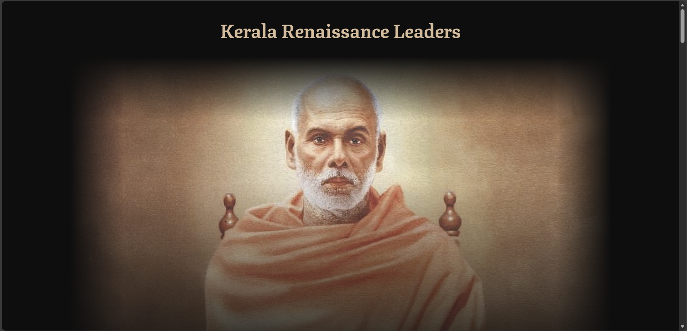
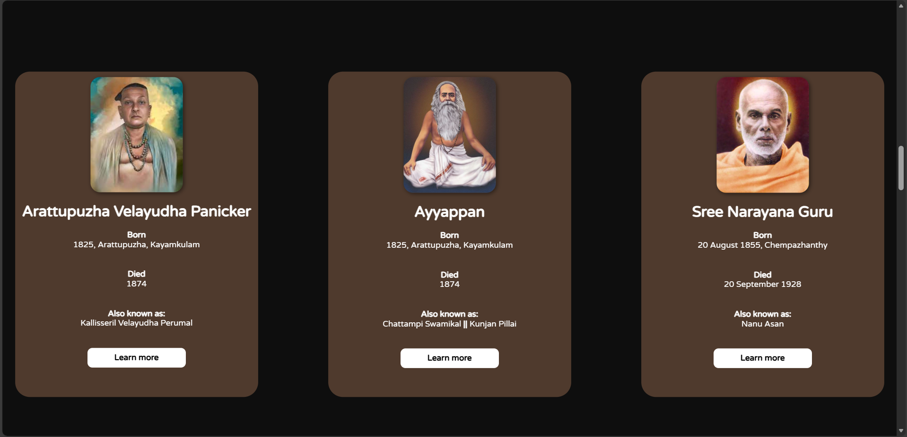
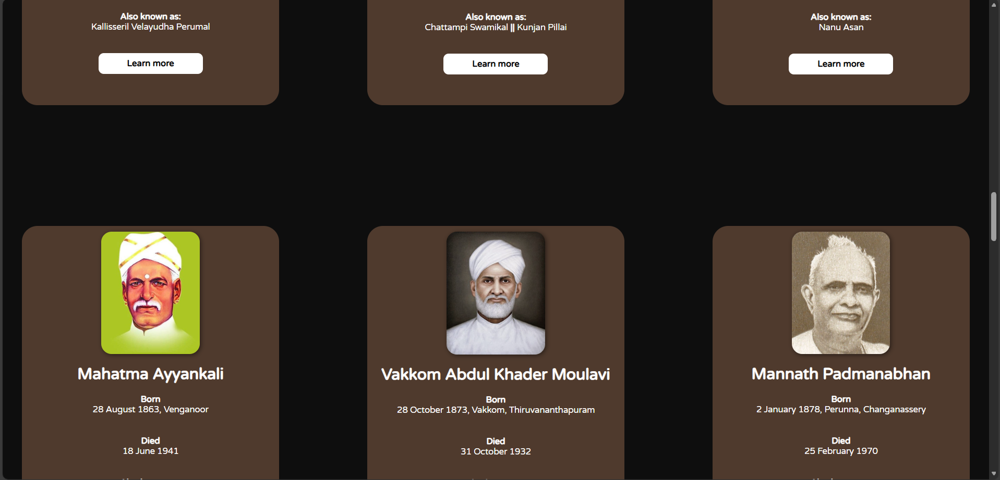
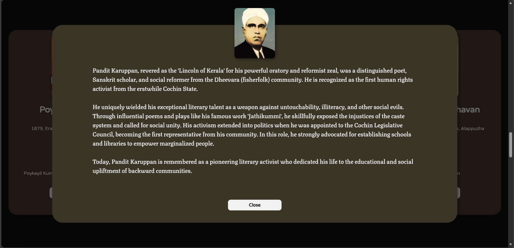
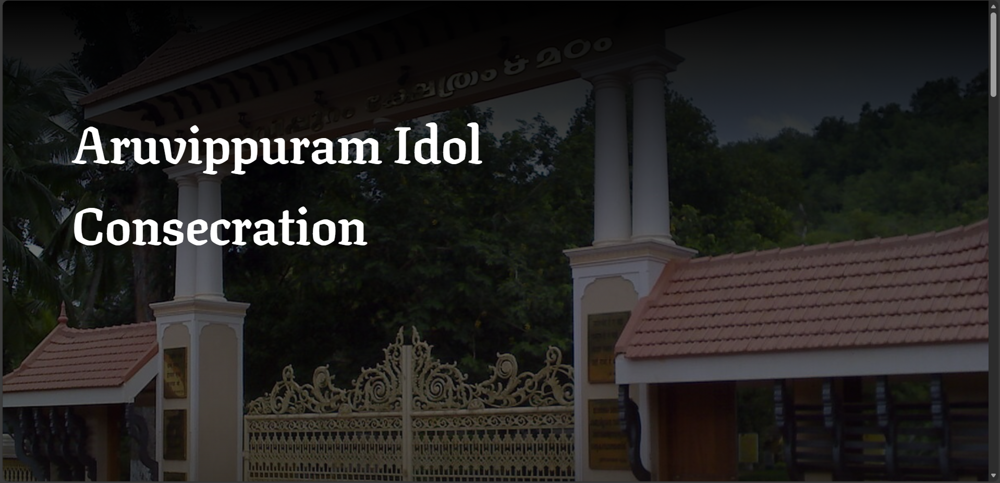
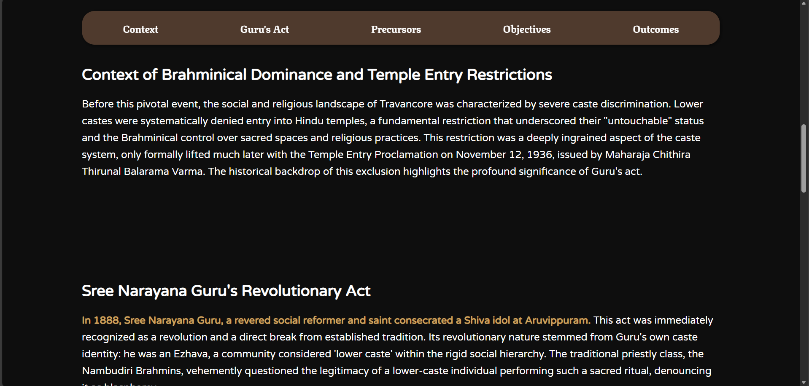

# Kerala Renaissance Leaders (`index.html`)
An interactive web project showcasing key figures of the Kerala Renaissance, a major socio-cultural reform movement that transformed Kerala in the 
19th and 20th centuries. The website provides brief biographies, images, and pop-up windows with detailed information about 19 influential reformers 
such as Sree Narayana Guru, Ayyankali, Chattampi Swamikal, Vakkom Moulavi, Poykayil Appachan, Dakshayani Velayudhan, and more.

  

# Features
## Smooth Interactive UI
- Animated introduction section triggered by IntersectionObserver.
- Zoom-in card effects when reformer profiles enter the viewport.

 

## Dynamic Pop-up Windows
- Clicking “Learn more” on any card opens a modal-style content window.
- Detailed biography text loads dynamically via JavaScript.
- Background dims with a gradient overlay to focus user attention.

  

# Preview

 
---

 
---

 
---

  

# Aruvippuram Idol Consecration (`Aruvippuram.html`)
This subpage provides an in-depth explanation of the Aruvippuram Pratishta (1888) performed by Sree Narayana Guru, one of the most pivotal events 
in Kerala’s social reform history. The page is part of the Kerala Renaissance Leaders project.

  

# Preview

 
---

